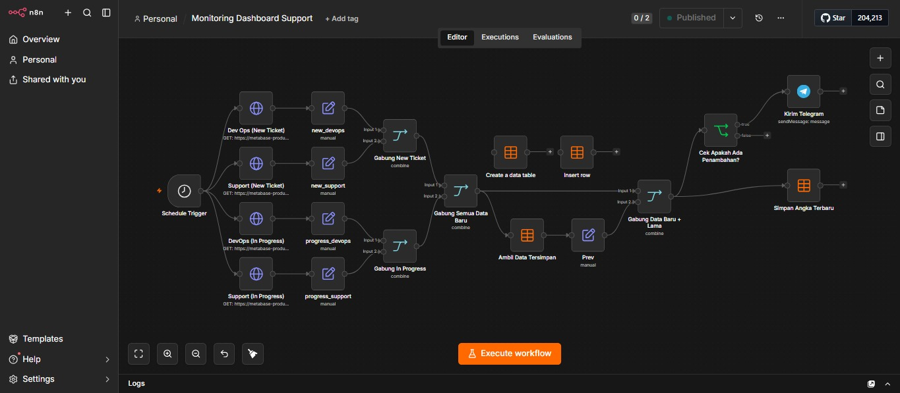
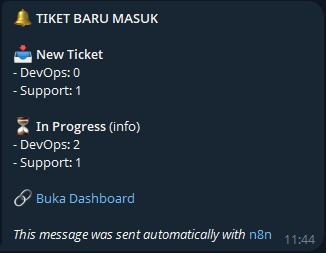

# Ticketing Dashboard Monitoring Automation

Automation workflow untuk melakukan monitoring ticketing pada tim Operasional & Pemeliharaan menggunakan n8n.

Workflow mengambil data ticketing dari dashboard Metabase secara berkala, membandingkan data terbaru dengan data sebelumnya, kemudian mengirimkan notifikasi melalui Telegram apabila terdapat penambahan ticket.

## Workflow Overview

Alur automation:

1. Schedule Trigger menjalankan workflow secara berkala.
2. n8n mengambil data ticketing dari Metabase.
3. Data dipisahkan berdasarkan kategori DevOps dan Support.
4. Data terbaru dibandingkan dengan data sebelumnya.
5. State monitoring disimpan menggunakan n8n Data Table.
6. Jika terdapat penambahan ticket, workflow mengirimkan notifikasi melalui Telegram.

## Tools & Technologies

- **n8n** — Workflow automation
- **Metabase** — Data source / ticketing dashboard
- **Telegram** — Notification
- **n8n Data Table** — Menyimpan state monitoring

## Monitoring

Workflow melakukan monitoring terhadap:

- DevOps New Ticket
- Support New Ticket
- DevOps In Progress
- Support In Progress

## Workflow Structure

```text
Schedule Trigger
       ↓
   Metabase
       ↓
  Get Ticket Data
       ↓
   Merge Data
       ↓
Compare With Previous State
       ↓
  ┌───────────────┐
  │ Ada Penambahan│
  └───────┬───────┘
          ↓
    Telegram Alert
          ↓
   Update Monitoring
       State
```

## Workflow Screenshot



## Notification Result

